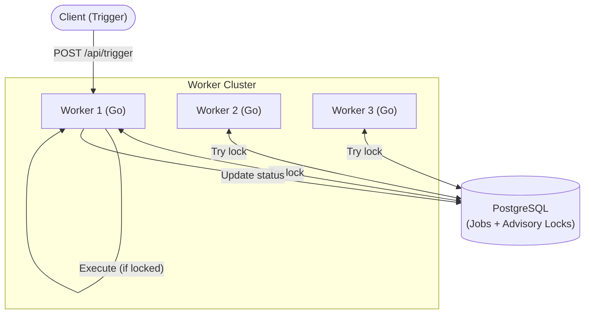

# Architecture — distributed-job-scheduler
> Last updated: 2026-08-29 | Maturity: Full Prototype
> _Leader-election based distributed cron scheduler using Postgres advisory locks._

## System Diagram
The following Mermaid.js sequence diagram maps the core workflow and interactions:

## Component Table

| Component | File | Responsibility | Tech |
|---|---|---|---|
| API Server | `cmd/api/main.go` | Exposes job trigger and health endpoints | Go |
| Scheduler Core | `internal/scheduler/scheduler.go` | Main execution loop & lock acquisition | Go |
| Database Layer | `internal/db/postgres.go` | Interface for `pg_advisory_xact_lock` | Go/Postgres |

## Port Assignments

| Service | Port | Notes |
|---|---|---|
| API Server | `8080` | Main HTTP entrypoint |

## Dependency Honesty Table

| Dependency | Status | Notes |
|---|---|---|
| PostgreSQL | **Real** | Required for distributed locking and state. |
| Job Payload | **Simulated** | Executes a simulated delay instead of real heavy lifting. |
